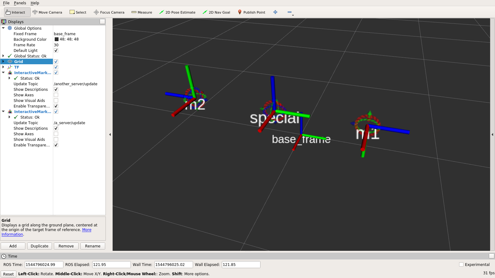

ROS Interactive Object Server
===
This package provides functionality to initialize a set of RViz [interactive marker servers](https://wiki.ros.org/rviz/Tutorials/Interactive%20Markers%3A%20Getting%20Started) and markers.
Each marker will be equipped with 6-DOF controls, allowing the user to set a TF frame by manipulating the controls.

### Installation

To use this package, clone the repository into your catkin workspace.

### Usage
When launched, the `object_server` node will look for the parameter `marker_servers` on the ROS parameter server.
This sets the interactive marker servers to be used by the node.
For each server, the user can specify an arbitrary number of markers.

An example configuration file which can be loaded in the parameter server is
```yaml
marker_servers: ['a_server', 'another_server']

a_server:
  marker_names: ['m1', 'm2']

  m1:
    parent_frame: 'base_frame'
    name: 'm1'
    initial_pose: [0.5, 0.5, 0.5, -0.707, 0.0, 0, 0.707]

  m2:
    parent_frame: 'base_frame'
    name: 'm2'
    initial_pose: [0.5, -0.5, 0.5, 0.707, 0.0, 0.0, 0.707]

another_server:
  marker_names: ['special_marker']

  special_marker:
    parent_frame: 'base_frame'
    name: 'special'
    initial_pose: [0.5, 0.0, 0.5, 0, 0, 0, 1]
```

You can test this configuration by launching the example launch file provided in this repository:
```
$ roslaunch object_server example.launch
```

You can now open RViz. Add a TF display, set the fixed_frame to `base_frame` and you can add two `InteractiveMarker` displays, one for the `update_topic: a_server` the other to `another_server`. You should now be able to change the pose of the markers by clicking and dragging on RViz:


